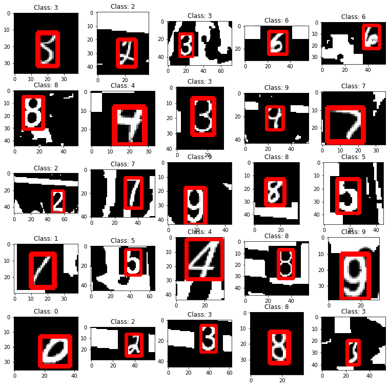

# MNIST2SVHN
Convert MNIST dataset to a SVHN-like real life dataset. 


## MNIST (+ My Original Dataset)
The MNIST+ dataset pickle file can be downloaded from [Mega](https://mega.nz/#!059nWJQQ!atsT9zm0L-AhecGKuLNZINqrI983EiUiMz05NGgQ50s)
It contains 140,000 examples (120,000 + 20,000)<br/>
If you wish to start generating your own dataset from scratch, you can download this dataset, and use MNIST2SVHN-plus-ultra.ipynb to generate. <br/>

## MNIST2SVHN dataset (Converted)
You can also download pre-converted dataset from [Mega](https://mega.nz/#!1htDERgC!rj3395fSG10_YmyLFq1N7V3uMp3JLICdnMhtnZ_VQZI)

</img>

## How to read the Pickle files
This is an example of reading the pickle file "Dataset_new.pkl". 
At the end, you will get a list of features named "total_x" and a list of labels "total_y"

```python
>>> f = open("Dataset_new.pkl", "rb")
>>> letter_set = pickle.load(f, encoding="latin1")
>>> f.close()
>>> type(letter_set)
<class 'tuple'>
>>> len(letter_set)
2
>>> total_x = None
>>> total_y = None
>>> for i in range(len(letter_set)):
...     if letter_set[i] == "EOF":
...             break
...     x = letter_set[i][0]
...     y = letter_set[i][1]
...     if total_x is None:
...             total_x = x
...             total_y = y
...     else:
...             total_x = np.concatenate((total_x, x), axis=0)
...             total_y = np.concatenate((total_y, y), axis=0)
...     print(len(total_x))
...
140000
```