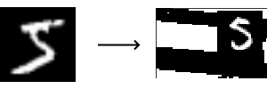

# MNIST2SVHN
Convert MNIST dataset to a SVHN-like real life dataset. 

## MNIST (+ My Original Dataset)
The MNIST+ dataset pickle file can be downloaded from <a>Mega</a>
It contains 140,000 examples (120,000 + 20,000)
If you wish to start generating your own dataset from scratch, you can download this dataset, and use MNIST2SVHN-plus-ultra.ipynb to generate. 

## MNIST2SVHN dataset (Converted)
You can also download pre-converted dataset from <a>Mega</a>

</img>